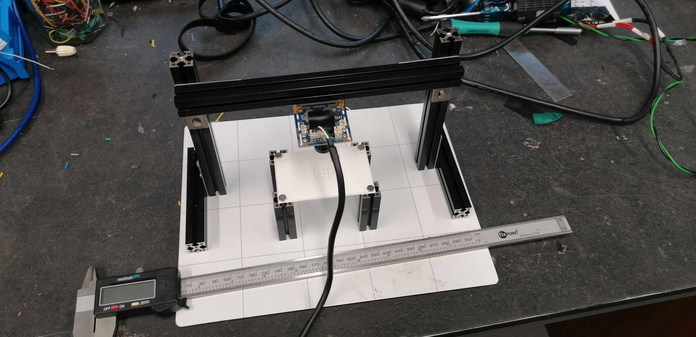
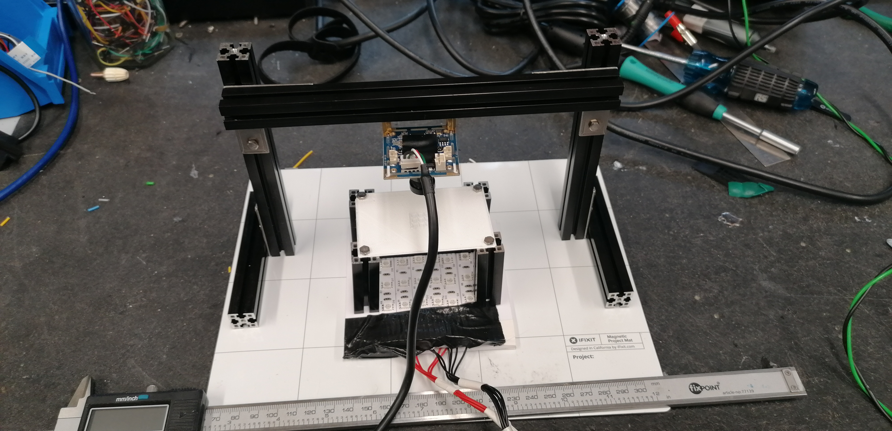
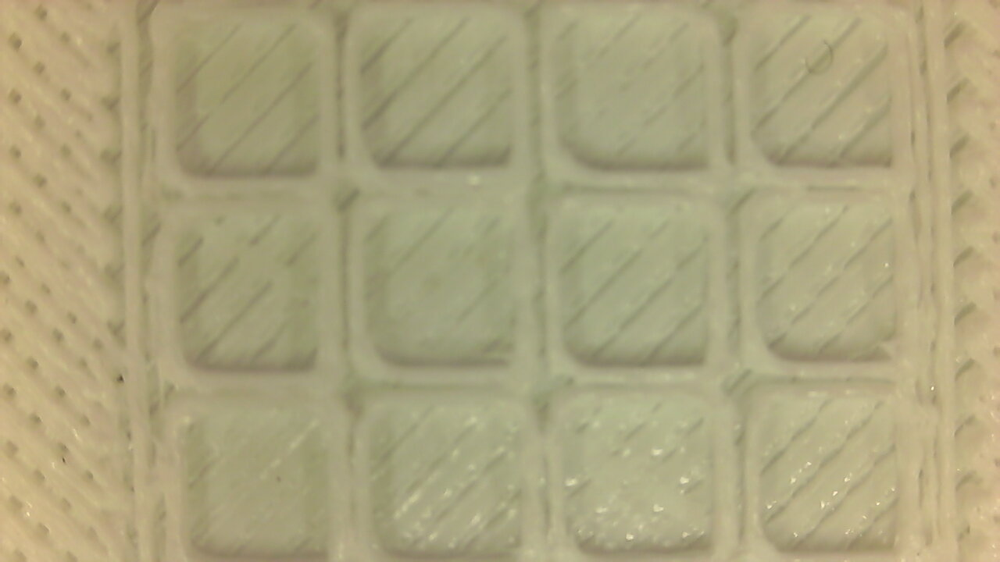
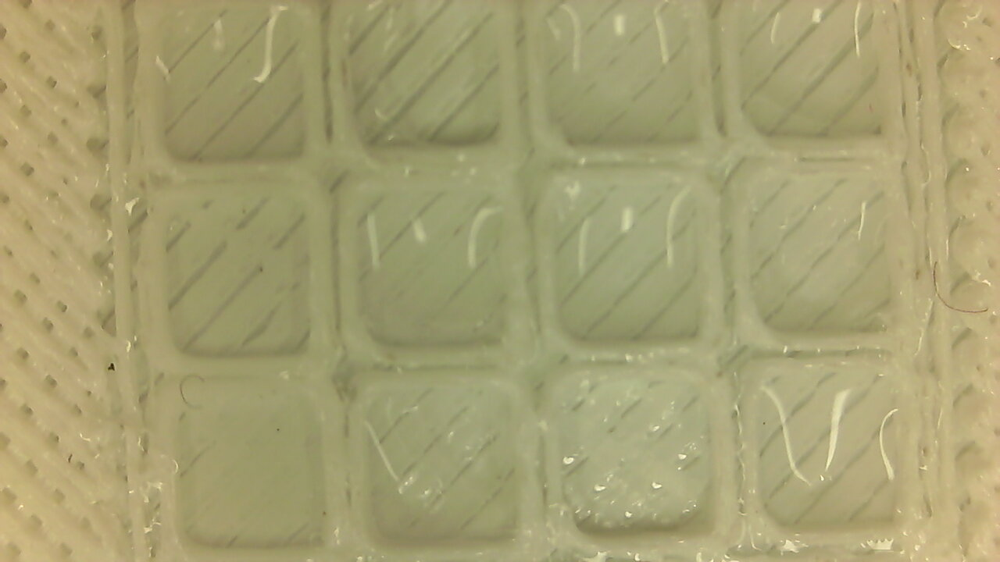
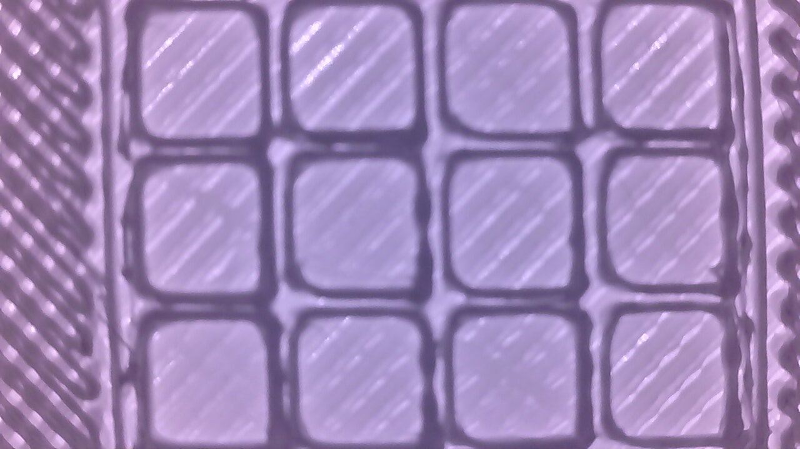
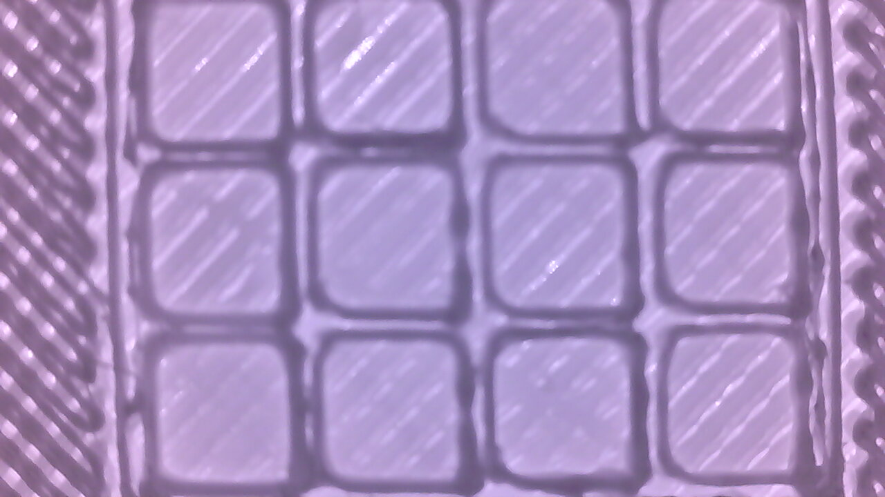

# Drosophila embryo monitoring system

This is a small video system to monitor the development of Drosophila embryos.

--- 

## Hardware:

|Qty|item|obs|link|
|--|--|--|--|
|4|50mm makerbeam XL aluminium profiles|pieces to hold the grid that will contain the embryos aluminium profiles||
|1|200mm makerbeam XL aluminium profiles|pieces to hold the grid that will contain the embryos aluminium profiles||
|2|100mm makerbeam XL aluminium profiles|camera mounting frame||
|2|150mm makerbeam XL aluminium profiles|camera mounting frame||
|4|"L" bracket makerbeam XL|holds the aluminium profiles together||
|1|3D printed embryo grid|initially printed in black PLA||
|18|M3 5mm screws| holds maker beams and other bits together||
|14|M3 nuts|used together with screws||
|1|ELP USB camera|||
|1|infrared led strip|for illumination from bottom||
|1|potentiometer|to adjust the brightness of the leds||
|1|12V power supply|power led strip||

  
---

## Software:
  
  - For this system we used Bonsai-RX to control the camera, as it allows for flexibility in determining time lapse rates and movement tracking of the embryos. 

  
--- 

## Setup images:

|||
|--|--|
|||

---

## Some initial taken with the setup images:

- note: the printer used to make the grid in the images below was poorly calibrated, the final grid looks much better.

||empty|water|
|--|--|--|
|Visible light|||
|Infra red light|||

